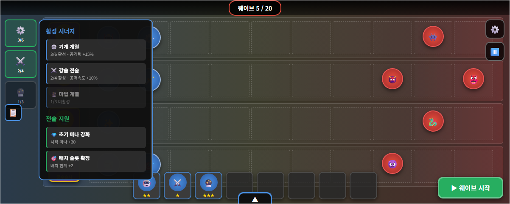

# 택티카 디펜스 기획서

# 목차
# 1. 게임 개요

## 1.1 한 줄 소개(피치)

매력적인 캐릭터를 육성 할 수 있는 오토배틀러 디펜스 게임

## 1.2 핵심 세일즈 포인트

#### 1) 오토배틀러에 수집·육성 컨텐츠 결합

- 가챠를 통해 **매력적인 캐릭터와 함께 ‘게임에 등장 가능한 시너지(특성)’**를 획득
- 획득한 시너지는 **육성**할 수 있으며, 육성한 시너지로 **이번 런에 등장할 시너지 풀/구성을 빌딩** 가능
- 수집·육성의 성과가 곧 **조합 선택지 확장**으로 이어져 장기 플레이 동기 강화

#### 2) 덱 빌딩 기반 전략 다변화로 반복 플레이 지루함 감소

- 기존 오토배틀러는 메타가 굳을수록 **조합이 고착화되어 반복감**이 커지는 단점이 있음
- 본 게임은 보유 시너지에 따라 **플레이어가 이번 런의 등장 시너지 풀/구성을 직접 설계**
- 시너지 빌딩 결과에 따라 매 게임 **조합 경로와 운영 판단**이 달라져 반복 플레이의 지루함을 완화

#### 3) PvE 구조로 ‘완성된 조합’의 재미를 끝까지 경험

- PvP 오토배틀러는 고도화된 조합이 완성되기 전에 **게임이 종료되는 경우**가 많음
- 본 게임은 PvE 기반으로, 진행 중 **다양한 버프/강화 선택지**를 제공해 전략을 단계적으로 고도화
- 완성된 팀 조합과 시너지 운용의 재미를 **충분한 플레이 구간에서 체감**하도록 설계

## 1.3 레퍼런스 정리(TFT 요소 / PvsZ 요소)(작성중)

### 1) TFT(Teamfight Tactics)에서 차용하는 요소

#### (A) 그대로 채용한 요소

- **상점(Shop) 기반 덱 빌딩 루프**
   매 라운드 골드를 사용해 유닛을 구매/판매하고, 리롤을 통해 원하는 구성을 맞춰가는 흐름을 채용한다.
- **시너지(특성) 기반 팀 구성**
   특정 조합 조건을 만족하면 전투 보너스를 얻는 “시너지 임계치” 구조를 채용한다.
- **유닛 합성(중복 구매 → 승급)**
   동일 유닛을 모아 상위 단계(2성/3성 등)로 승급시키며 파워 스파이크를 만드는 재미를 채용한다.

#### (B) 본 게임에 맞게 변주한 요소

- **레벨업 시스템의 재정의(확률표 중심 → 해금 중심)**
   TFT처럼 “레벨업에 따른 코스트별 등장 확률 변화”를 핵심 규칙으로 두지 않고,
   **배치 확장(골드 구매)** 을 통해 **배치 상한을 늘리고 상위 티어 기물을 해금**하는 방식으로 변주한다.
- **시너지의 ‘랜덤 등장’이 아니라 ‘사전 덱 빌딩’ 기반 등장**
   덱 빌딩 단계에서 **시너지 4개를 선택**하고, 해당 시너지에 속한 기물만 런에서 등장하도록 제한한다.
   → 런의 전략 방향을 “상점 운”보다 “사전 선택(덱 구성)”에 더 강하게 연결한다.
- **기물 풀의 구조화(시너지당 8종: 3 / 2 / 2 / 1)**
   선택한 시너지 1개당 기물 8종이 등장하며, 티어 분포는 **1티어 3 / 2티어 2 / 3티어 2 / 4티어 1**로 고정한다.
   특히 **4티어는 ‘시그니처 캐릭터’ 1종이 직접 등장**하는 형태로 설계해, 덱의 정점(목표)을 명확히 만든다.

------

### 2) PvsZ(Plants vs Zombies)에서 차용하는 요소

#### (A) 그대로 채용한 요소

- **수비 측 고정 배치**
   아군 유닛은 전투 중 이동하지 않으며, “어디에 배치하느냐”가 핵심 전략이 된다.
- **공격 측 진군(웨이브 기반 진행)**
   적은 웨이브에 따라 아군 진영으로 몰려오며, 시간이 갈수록 압박이 증가한다.
- **레인 기반 디펜스 전투 감각**
   레인/사거리/탱킹/타겟팅 등 배치에 따른 결과가 전투를 좌우하는 “배치 퍼즐” 감각을 채용한다.

#### (B) 본 게임에 맞게 변주한 요소

- **배치 디펜스의 ‘준비 과정’을 오토배틀러식 상점/합성으로 대체**
   PvsZ의 설치형 운영 대신, 상점·리롤·합성으로 전력을 준비하고 웨이브를 넘기는 구조로 변주한다.
- **웨이브 대응의 중심을 ‘덱(시너지) 설계 + 배치 최적화’로 이동**
   스테이지/웨이브 성격에 맞춰 덱 구성(시너지 선택)과 배치를 조정하는 형태로 전략 축을 재구성한다.

------

### 3) 결합 포인트 (본 게임에서의 해석)

- **TFT의 상점·합성·시너지**로 “런마다 조합을 설계”하고,
- **PvsZ의 고정 배치·진군 웨이브**로 “전투를 배치 퍼즐로 해결”한다.
- 즉, **사전 덱 빌딩(시너지 4개 선택) → 상점 운영/합성으로 전력 구성 → 고정 배치로 웨이브 대응**의 3단 구조로 두 레퍼런스를 결합한다.

## 1.4 플레이어 목표(승리/패배 조건)

## 1.5 핵심 용어 정의(유닛/칸/코어/웨이브/특성/등급 등)

# 2. 게임 요소 개요

## 2.1. 요소

### 2.1.1 수집 / 육성

- **가챠**: 뽑기 시스템을 통해 전장에 등장할 **시너지(=소환술사)** 를 획득
  - 각 시너지는 해당 시너지를 대표하는 **캐릭터(소환술사)** 와 함께 제공
- **소환술사 육성**: 획득한 소환술사를 성장시켜, **전장**에서 해당 시너지의 성능을 강화
- **전술 지원(인게임 버프) 강화**: 재화를 사용해 **전장**에서 적용되는 효과를 획득·강화
  - 예) 시작 마나 +n, 시작 새로고침(리롤) +n, 초기 골드/상점 옵션 강화 등

### 2.1.2 전선(= 스테이지)

- **캠페인** : 전투의 끝이 존재하며, 전장을 클리어 할 때 마다 스토리가 진행됨
- **방어전** : 무한 모드

### 2.1.3  출전 편성(= 덱 빌딩)

- **편성 방식**: 전장 입장 전, 보유한 **소환술사(시너지) 4명**을 선택해 출전 편성을 구성
- **등장 기물** : 선택한 소환술사가 소환 가능한 소환수가 **소환 터미널**에 등장
  - 각 소환술사마다 8체, 4 * 8 = 32체의 소환수가 등장

### 2.1.4. 전장(=인게임)

#### 2.1.4.1. 전투방식

- **고정 배치 디펜스**: 소환수는 전투 중 이동하지 않음
- **웨이브 진행**: 적(침략자)은 웨이브 단위로 진군하며, 스테이지 진행에 따라 압박이 증가

#### 2.1.4.2. 팀 강화 방식

- **소환수 소환/ 리롤/ 판매**
  - 소환수의 희귀도(코스트) 분리는 존재하지 않음
- **소환수 합성**
- **소환 한계 확장**
- **시너지**
  - **계열** : 소환술사가 가지고 있는 시너지
  - **전술 특성** : 전장마다 랜덤으로 부여되는 시너지
    - 이전 전장에서는 A, B 유닛이 강습 전술 특성을 가지고 있었으나, 다음 전장에서는  C D 유닛이 강습 전술 특성을 가질 수 있음
- **전술 지원** : 전장 진행 중 특정 시점에 버프/강화 선택지를 제공하여 운영 방향과 전투 양상을 변화
- **출격 모듈**(?) : 전장 시작 시 적용되는 보너스를 통해 초반 운영을 보조
  - (예: 시작 마나, 시작 갱신 횟수 등)

# 3. 플레이 시나리오

## 3.1. 전장 시나리오

### 3.1.1. 전장 선택 / 출전 편성

#### 전장 선택

1. 메인 메뉴
2. 전장 출격 선택
3. [[캠페인]] 또는 방어전 선택
4. 임무 - 출격 선택

#### 출전 편성

1. 보유하고 있는 소환술사 중에 4명 선택
2. 등장 소환수 풀 확인
3. 출격

### 3.1.2. 전장 플레이 - 캠페인 기준

#### 전장 진입

1. 로딩 후 전장 입장
2. **출격 모듈** 적용(전장 시작 보너스 자동 반영)
3. 초기 마나/초기 소환 슬롯(배치 한계) 확인
4. 소환수 시너지 분표 표 확인
   1. 어떤 조합을 사용 할 수 있을지 전략 수립

#### 웨이브 진행(전투 루프)

##### 1. 첫번째 정비 페이즈 시작

1. 소환수 시너지 분표 표 확인
   1. 어떤 조합을 사용 할 수 있을지 전략 수립
2. **소환 터미널** 오픈 → 소환수 목록 확인
3. 마나를 사용해 소환수 **소환**
4. 소환수는 대기석에 배치됨
5. 대기석에 배치 된 소환수를 전장에 다시 배치
6. 웨이브 시작 터치

##### 2. 첫번째 전투 페이즈 시작

1. 적(침략자) 진군, 아군(소환수)은 고정 배치로 교전
2. 소환수의 HP가 0이 되면 다운 상태로 전환, 비활성화 되면 침략자는 무시하고 전진함
3. 모든 침략자 웨이브를 막아내면 전투 페이즈 종료

##### 3. 첫번째 전투 페이즈 종료 - 두번째 정비 페이즈 시작

1. 마나 이자 획득
2. 소환수 추가 소환
   1. 동일 소환수 3개 소환하면 자동 합성
3. 필요 시 소환 터미널 **갱신/잠금/배치 상한 추가**
4. 특정 웨이브(또는 체크포인트) 도달 시 **전술 지원** 선택(3택 1 등, 컨셉 확정 필요)

##### 4. 클리어/실패 및 정산

1. 침략자가 한 라인의 끝까지 도착하면, 소환술사와 직접 교전
2. 소환술사도 공격을 하며, 피격에 따라 HP 감소
3. 한명의 소환술사라도 HP가 0이 되면 전장 패배
4. 전장 종료 후 정산 화면 표시
   1. 획득 보상/재화 표시
   2. 소환술사 육성 재료 및 전술 지원/출격 모듈 관련 재화 반영
5. 로비 복귀 → 다음 전장 선택 또는 재도전

## 3.2. 육성 시나리오

### 3.2.1. 소환술사 모집

#### 로비 진입 흐름

1. 메인 메뉴 → **[모집]** 진입
2. 배너 선택
3. 모집 재화 확인 후 **1회 / 10회 모집** 선택
4. 결과 연출 → 획득 목록 표시

#### 모집 결과 처리

- **신규 소환술사 획득**
  - 소환술사(캐릭터) 해금 + 해당 소환술사의 **시너지 사용 가능**
  - 덱 빌딩(출전 편성) 화면에서 **선택 가능 목록**에 추가
- **중복 소환술사 획득**
  - 중복 캐릭터는 대신 심상조각 획득
  - 누적 조각으로 소환술사 승급

------

### 3.2.2. 소환술사 육성

1. 메인 메뉴 → **[소환술사] / [도감]** 진입
2. 소환술사 목록에서 1명 선택 -> 상세화면 진입
3. 레벨 업
   1. 레벨 업을 클릭해서 강화
   2. 레벨업을 하면 시너지 효과가 상승함
      - 예) 기계 특성 소환수 공격력 20 -> 공격력 22
   3. 레벨은 승급에 따라 한계치가 있음
4. 승급
   1. 레벨이 한계치에 도달한 경우 승급 가능
   2. 승급을 위해서는 해당 술사의 심상조각이 필요
   3. 승급을 눌러 심상 조각을 사용해서 승급
   4. 승급한 경우 시너지의 최대치가 상승 및 레벨 상한이 상승
      1. 2 / 3 / 4 -> 2 / 3 / 4 / 5

------

### 3.2.3. 전술 지원 획득 / 강화

#### 로비 진입 흐름

1. 메인 메뉴 → **[전술 지원 연구소]** 진입
2. 현재 해금한 전술 지원과 적용중인 전술 지원 확인 가능
3. 전술 지원은 특정 조건에 따라 해금
   1. 예) 엘프 계열 소환술사 3명 획득
   2. 임무 3 - 4 클리어 등
4. 인게임 재화를 사용해서 해금된 전술 지원을 연구(구매) 및 강화 가능
5. 획득한 전술 지원은 선택할 필요 없이 모두 자동 적용

# 0. 세계관 및 배경 설정

## 0.1 세계관 요약

ㅋ

# 용어 사전

- **전장**: 플레이어가 스테이지에 진입해 실제 전투(웨이브)를 진행하는 *한 판(런)* 단위의 인게임 플레이 구간.
- **소환 터미널**(=오토배틀러의 상점): 전장 내에서 소환술사가 소환 가능한 소환수(기물) 목록을 확인하고, **마나를 소모해 소환**하는 기능(기존 ‘상점’)을 의미한다.
  - 소환 터미널에서는 **목록 갱신(새로고침)**, **소환(구매)**, **환원(판매)**, **잠금(고정)** 등의 조작이 가능하다.
