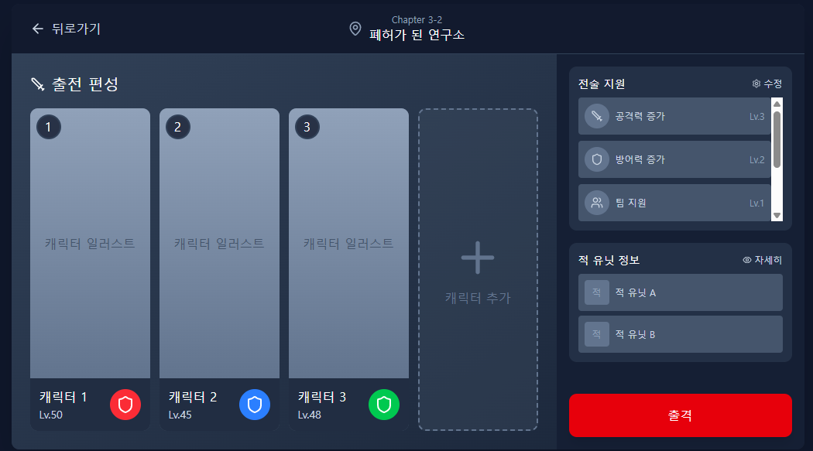
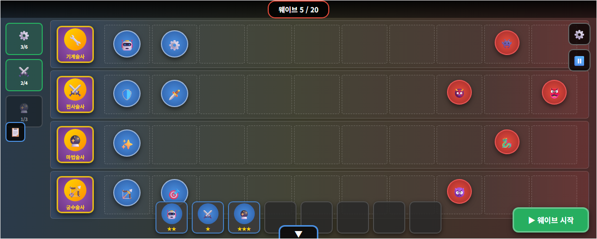

# 택티카 디펜스 기획서

기획서 분리

1. 개요
2. 게임 구성 요소
3. 플레이 시나리오
4. 세계관
5. 스타일(그래픽)
6. 컨텐츠
7. 게임 시스템 -> 게임 시스템 기획서로 분리
   1. 인게임(전장)
   2. 육성
   3. 덱빌딩
   4. 컨텐츠
8. 레벨디자인 및 스케일링
9. 기술
10. 사운드
11. 일정
12. 기타

# 1. 게임 개요

## 1.1 한 줄 소개(피치)

매력적인 고양이 소환수와 소환술사 캐릭터를 수집·육성해, 빌드한 팀의 카타르시스를 충분히 즐기는 싱글 PvE 오토배틀러 디펜스 게임.

## 1.2 핵심 세일즈 포인트

#### 1) 오토배틀러에 수집·육성 컨텐츠 결합

- 가챠를 통해 **매력적인 캐릭터와 함께 ‘게임에 등장 가능한 시너지(특성)’**를 획득
- 획득한 시너지는 **육성**할 수 있으며, 육성한 시너지로 **이번 런에 등장할 시너지 풀/구성을 빌딩** 가능
- 수집·육성의 성과가 곧 **조합 선택지 확장**으로 이어져 장기 플레이 동기 강화

#### 2) 덱 빌딩 기반 전략 다변화로 반복 플레이 지루함 감소

- 기존 오토배틀러는 메타가 굳을수록 **조합이 고착화되어 반복감**이 커지는 단점이 있음
- 본 게임은 보유 시너지에 따라 **플레이어가 이번 런의 등장 시너지 풀/구성을 직접 설계**
- 시너지 빌딩 결과에 따라 매 게임 **조합 경로와 운영 판단**이 달라져 반복 플레이의 지루함을 완화

#### 3) PvE 구조로 ‘완성된 조합’의 재미를 끝까지 경험

- PvP 오토배틀러는 고도화된 조합이 완성되기 전에 **게임이 종료되는 경우**가 많음
- 본 게임은 PvE 기반으로, 진행 중 **다양한 버프/강화 선택지**를 제공해 전략을 단계적으로 고도화
- 완성된 팀 조합과 시너지 운용의 재미를 **충분한 플레이 구간에서 체감**하도록 설계

## 1.3 레퍼런스 정리(TFT 요소 / PvsZ 요소)(작성중)

### 1) TFT(Teamfight Tactics)에서 차용하는 요소

#### (A) 그대로 채용한 요소

- **상점(Shop) 기반 덱 빌딩 루프**
  매 라운드 골드를 사용해 유닛을 구매/판매하고, 리롤을 통해 원하는 구성을 맞춰가는 흐름을 채용한다.
- **시너지(특성) 기반 팀 구성**
  특정 조합 조건을 만족하면 전투 보너스를 얻는 “시너지 임계치” 구조를 채용한다.
- **유닛 합성(중복 구매 → 승급)**
  동일 유닛을 모아 상위 단계(2성/3성 등)로 승급시키며 파워 스파이크를 만드는 재미를 채용한다.

#### (B) 본 게임에 맞게 변주한 요소

- **레벨업 시스템의 재정의(확률표 중심 → 해금 중심)**
  TFT처럼 “레벨업에 따른 코스트별 등장 확률 변화”를 핵심 규칙으로 두지 않고,
  **배치 확장(골드 구매)** 을 통해 **배치 상한을 늘리고 상위 티어 기물을 해금**하는 방식으로 변주한다.
- **시너지의 ‘랜덤 등장’이 아니라 ‘사전 덱 빌딩’ 기반 등장**
  덱 빌딩 단계에서 **시너지 4개를 선택**하고, 해당 시너지에 속한 기물만 런에서 등장하도록 제한한다.
  → 런의 전략 방향을 “상점 운”보다 “사전 선택(덱 구성)”에 더 강하게 연결한다.
- **소환술사의 전장 등장(아이디어)**
  배치 상한 해제에 따라 소환술사가 직접 소환 터미널에 등장하여 전장에 배치되는 방식을 검토 중이다.

------

### 2) PvsZ(Plants vs Zombies)에서 차용하는 요소

#### (A) 그대로 채용한 요소

- **수비 측 고정 배치**
  아군 유닛은 전투 중 이동하지 않으며, “어디에 배치하느냐”가 핵심 전략이 된다.
- **공격 측 진군(웨이브 기반 진행)**
  적은 웨이브에 따라 아군 진영으로 몰려오며, 시간이 갈수록 압박이 증가한다.
- **레인 기반 디펜스 전투 감각**
  레인/사거리/탱킹/타겟팅 등 배치에 따른 결과가 전투를 좌우하는 “배치 퍼즐” 감각을 채용한다.

#### (B) 본 게임에 맞게 변주한 요소

- **배치 디펜스의 ‘준비 과정’을 오토배틀러식 상점/합성으로 대체**
  PvsZ의 설치형 운영 대신, 상점·리롤·합성으로 전력을 준비하고 웨이브를 넘기는 구조로 변주한다.
- **웨이브 대응의 중심을 ‘덱(시너지) 설계 + 배치 최적화’로 이동**
  스테이지/웨이브 성격에 맞춰 덱 구성(시너지 선택)과 배치를 조정하는 형태로 전략 축을 재구성한다.

------

### 3) 결합 포인트 (본 게임에서의 해석)

- **TFT의 상점·합성·시너지**로 “런마다 조합을 설계”하고,
- **PvsZ의 고정 배치·진군 웨이브**로 “전투를 배치 퍼즐로 해결”한다.
- 즉, **사전 덱 빌딩(시너지 4개 선택) → 상점 운영/합성으로 전력 구성 → 고정 배치로 웨이브 대응**의 3단 구조로 두 레퍼런스를 결합한다.

## 1.4 플레이어 목표(승리/패배 조건)

### 1.4.1 한 전장 단위

- **승리 조건(=임무 완수)**: 본편의 모든 라운드를 클리어한다.
  - 본편 클리어 후, 플레이어 선택에 따라 **무한 모드**로 이어 진행할 수 있다. (자세한 내용은 6. 컨텐츠 / 레벨디자인 문서 참고)
- **패배 조건(=임무 실패)**:
  - **본편**: 패배 횟수 누적 3회.
  - **무한 모드**: 진입 시 잔여 패배 횟수가 0으로 리셋되어 1회 패배만으로 즉시 전장 종료.

### 1.4.2 캠페인 단위

- 전역에 포함된 모든 전장을 클리어하면 다음 전역으로 진행한다.
- 모든 전역을 클리어하면 캠페인 엔딩에 도달한다.

## 1.5 핵심 용어 정의

- **소환술사(Summoner)**: 인간 플레이어 캐릭터. 가챠로 모집·육성하는 수집 대상. 각자 고유한 **심상 효과**를 가진다.
- **소환수**: 소환술사가 소환하는 전투 유닛. 본 게임의 소환수는 모두 **고양이**이다. 각 소환술사는 5체의 고유 소환수를 보유한다.
- **심상**: 소환술사가 다루는 모티프. 본 게임에서는 모든 심상이 **고양이 품종**(스코티시폴드·스핑크스·코리안숏헤어 등)으로 표현된다.
- **심상 효과**: 소환술사가 가진 고유 시너지. 같은 심상의 소환수에게 적용되는 **메인 효과** 와, 다른 심상의 소환수에게도 약하게 적용되는 **글로벌 버프** 의 이중 컴포넌트 구조를 가진다.
- **소환수 효과**: 전장마다 랜덤으로 소환수에게 부여되는 시너지. 한 전장에서 5개의 소환수 효과가 등장한다.
- **출전 편성**: 한 전장에 데려갈 소환술사 4명을 선택하는 단계. 같은 심상(품종)을 가진 소환술사는 중복 편성 불가.
- **전장(=인게임)**: 한 판 단위. 정비 페이즈와 전투 페이즈가 교차하는 라운드들로 구성된다.
- **라운드**: 한 전장 안의 단위. 정비 페이즈 → 전투 페이즈 한 쌍.
- **소환 터미널**: 마나로 소환수를 소환하는 인터페이스. 매 라운드 시작 시 4개의 소환수 후보가 등장한다.
- **마나**: 인게임 자원. 소환·재스캔·배치 상한 증가·전술 지원 새로고침에 사용.
- **전술 지원**: 인게임 진행 중 일정 라운드마다 등장하는 강화 선택지. 본 게임에서 팀의 출력을 결정하는 핵심 강화 축.
- **출격 모듈**: 메타에서 미리 해금·강화해두는 영구 적용형 강화. 한 전장 안에서 보유한 모든 모듈이 자동 적용된다.
- **본편**: 한 전장의 정규 라운드 구간. 승리 조건 달성 대상.
- **무한 모드**: 본편 클리어 후 선택적으로 이어 진행하는 추가 라운드. 난이도가 가파르게 상승.

# 2. 게임 요소 개요

## 2.1. 요소

### 2.1.1 수집 / 육성

본 게임의 메타 진행은 다음 4가지 강화 축으로 구성된다.

- **가챠 (수집)**: 뽑기 시스템으로 **소환술사**(=심상 효과를 가진 캐릭터)를 획득.
  - 신규 소환술사 획득 = 새로운 심상 효과·캐릭터 매력·소환수 풀의 확보.
  - **전술 지원도 가챠 수집 대상** 으로 확장된다. 잠정적으로 소환술사 가챠와 전술 지원 가챠는 분리된 풀로 운영된다.
- **소환술사 육성**: 획득한 소환술사를 성장시켜 심상 효과를 강화.
- **전술 지원 연구·강화**: **전술 지원 연구소** 에서 보유한 전술 지원을 강화. 인게임에서 등장하는 전술 지원의 효과 강도가 상승.
- **출격 모듈 강화**: 한 전장의 시작과 진행 전반에 영구 적용되는 효과를 강화.
  - 예) 시작 마나 +n, 시작 재스캔 +n, 적 처치 시 일정 확률로 추가 마나 획득 등.
  - 보유한 모든 모듈이 한 전장 시작 시 자동 적용된다.

**재화 체계 (2종 분리 원칙)**

| 카테고리 | 용도 |
|---|---|
| **가챠 재화** | 소환술사 모집 · 전술 지원 모집 |
| **강화 재화** | 출격 모듈 강화 · (그 외 강화 시스템) |

자세한 강화 시스템 구조는 [[08-2 육성 스케일링]] 문서를 참고한다.

### 2.1.2 전선(= 스테이지)

- **캠페인** : 정해진 라운드 수의 본편이 존재하는 스토리 모드. 전장을 클리어 할 때마다 스토리가 진행된다.
  - 각 전장은 본편 클리어 후 **자율 무한 모드** 로 이어진다 (자세한 내용은 [[08-1 컨텐츠 레벨디자인]] 참고).
- **방어전** : 처음부터 무한 모드로 진행되는 별도 모드.

### 2.1.3  출전 편성(= 덱 빌딩)

- **편성 방식**: 전장 입장 전, 보유한 **소환술사 4명** 을 선택해 출전 편성을 구성.
  - 4명은 **서로 다른 심상(고양이 품종)** 을 가진 소환술사여야 한다.
  - 같은 심상의 소환술사를 중복 편성할 수 없도록 하여, 동일한 심상 소환수가 소환 터미널에 중복 등장하는 상황을 방지.
  - 출전 편성은 단순한 캐릭터 선택이 아니라, **소환술사별 역할군 분포** 를 고려해 4명의 합산 분포가 균형을 이루도록 설계하는 *빌딩 결정의 첫 단계* 이다.
- **등장 소환수 풀**: 선택한 소환술사가 가진 소환수가 **소환 터미널** 의 소환 풀이 된다.
  - 소환술사 1명당 **고유 소환수 5체** 보유. 4명 출전 시 총 **20체** 의 풀이 구성된다.
  - 각 소환술사의 소환수 5체는 **5개의 역할군**(탱커 / 원거리 딜러 / 근거리 딜러 / 마법사 / 힐러)에 **기본적으로 균형 잡힌 분포** 를 가진다. 단 소환술사마다 ±1 수준의 작은 바리에이션이 있어 각 소환술사의 정체성을 만든다. (자세한 분포 규칙은 [[07 게임 시스템 기획서]] 2장 참고)

### 2.1.4. 전장(=인게임)

#### 2.1.4.1. 전투방식

- **고정 배치 디펜스**: 소환수는 전투 중 이동하지 않음
- **웨이브 진행**: 적(침략자)은 웨이브 단위로 진군하며, 스테이지 진행에 따라 압박이 증가

#### 2.1.4.2. 팀 강화 방식

본 게임에서 팀을 강화하는 축은 다음과 같다. TFT 와 달리 본 게임은 **유닛 레벨(코스트별 등장 확률 변화)·레어도·아이템 시스템을 두지 않는다.** 선택 축을 줄이는 대신 시너지·전술 지원에 결정의 깊이를 집중한다.

- **소환·재스캔·환원**: 마나를 사용해 소환 터미널에서 소환수를 소환/판매. 소환수에 희귀도(코스트) 분리는 존재하지 않는다.
- **소환수 합성**: 동일 소환수 3개 모으면 상위 성급으로 승급. 3성 이후에는 2성 1개씩 추가 강화.
- **배치 상한 증가**: 마나를 사용해 전장 배치 가능 소환수 수를 늘리는 동시에 상위 성급 등장 확률을 해금.
- **시너지 (2차원 구조)**:
  - **심상 효과** (소환술사 귀속): 출전 편성한 4명의 소환술사가 가진 고유 시너지. 메인 효과(같은 심상 소환수 강화) + 글로벌 버프(전체 소환수 약한 강화)의 이중 컴포넌트로 구성된다.
  - **소환수 효과** (전장마다 랜덤): 매 전장 시작 시 5개의 효과가 등장하여, 소환수에 무작위로 분배된다. 동일 소환수도 전장마다 다른 효과를 가질 수 있다.
- **전술 지원**: 일정 라운드마다 등장하는 3택 1 강화 선택지. **본 게임에서 팀의 출력을 결정하는 핵심 강화 축** 이다. 시너지가 팀의 *방향* 을 결정한다면, 전술 지원은 그 방향의 *출력* 을 결정한다.
- **출격 모듈** (메타 영구 적용): 전장 시작과 진행 전반에 영구적으로 영향을 미치는 강화. 메타에서 미리 해금·강화해두면 보유한 모든 모듈이 한 전장에 자동 적용된다.

# 3. 플레이 시나리오

## 3.1. 전장 시나리오

### 3.1.1. 전장 선택 / 출전 편성

#### 전장 선택

1. 메인 메뉴
2. 전장 출격 선택
3. [[캠페인]] 또는 방어전 선택
4. 임무 - 출격 선택

#### 출전 편성

1. 보유하고 있는 소환술사 중에 4명 선택
2. 등장 소환수 풀 확인
3. 출격

### 3.1.2. 전장 플레이 - 캠페인 기준

#### 전장 진입

1. 로딩 후 전장 입장
2. **출격 모듈** 적용(전장 시작 보너스 자동 반영)
3. 초기 마나/초기 소환 슬롯(배치 한계) 확인
4. 소환수 시너지 분표 표 확인
   1. 어떤 조합을 사용 할 수 있을지 전략 수립

#### 웨이브 진행(전투 루프)

##### 1. 첫번째 정비 페이즈 시작

1. 소환수 시너지 분표 표 확인
   1. 어떤 조합을 사용 할 수 있을지 전략 수립
2. **소환 터미널** 오픈 → 소환수 목록 확인
3. 마나를 사용해 소환수 **소환**
4. 소환수는 대기석에 배치됨
5. 대기석에 배치 된 소환수를 전장에 다시 배치
6. 웨이브 시작 터치

##### 2. 첫번째 전투 페이즈 시작

1. 적(침략자) 진군, 아군(소환수)은 고정 배치로 교전
2. 소환수의 HP가 0이 되면 다운 상태로 전환, 비활성화 되면 침략자는 무시하고 전진함
3. 모든 침략자 웨이브를 막아내면 전투 페이즈 종료

##### 3. 첫번째 전투 페이즈 종료 - 두번째 정비 페이즈 시작

1. 마나 이자 획득
2. 소환수 추가 소환
   1. 동일 소환수 3개 소환하면 자동 합성
3. 필요 시 소환 터미널 **갱신/잠금/배치 상한 추가**
4. 일정 라운드마다 **전술 지원** 3택 1 선택 등장 (잠정 약 3라운드마다 1회)
   - 3개의 선택지 중 1개 선택. 새로고침은 마나로 가능 (새로고침 비용은 누를 때마다 2배씩 증가)
   - 등장 알고리즘은 플레이어가 현재 맞추고 있는 시너지·이전에 선택한 전술 지원에 따라 보정되어, 빌드에 어울리는 선택지가 등장하기 쉽도록 한다

##### 4. 본편 종료 — 자율 무한 모드 진입 선택지

1. 본편의 모든 라운드를 클리어하면 **본편 승리** 메시지가 표시된다.
2. 플레이어는 다음 중 선택할 수 있다:
   - **전장 종료**: 본편 클리어 보상을 받고 로비 복귀.
   - **무한 모드 진입**: 잔여 패배 횟수가 0으로 리셋되며, 난이도가 가파르게 상승하는 무한 라운드가 시작된다. 1회 패배 시 즉시 전장 종료.
3. 보상 정산:
   - 최종 보상 = 본편 클리어 보상 × 무한 모드 배수.
   - 무한 모드 1라운드 클리어마다 +0.1 배수.

##### 5. 클리어/실패 및 정산

1. 침략자가 한 라인의 끝까지 도착하면, 소환술사와 직접 교전
2. 소환술사도 공격을 하며, 피격에 따라 HP 감소
3. 한명의 소환술사라도 HP가 0이 되면 전장 패배 (본편 패배 누적 3회 / 무한 모드 1회 시 임무 실패)
4. 전장 종료 후 정산 화면 표시
   1. 획득 보상/재화 표시 (무한 모드 진행 시 배수 적용)
   2. 소환술사 육성 재료, 가챠 재화, 강화 재화 반영
5. 로비 복귀 → 다음 전장 선택 또는 재도전

## 3.2. 육성 시나리오

### 3.2.1. 소환술사 모집

#### 로비 진입 흐름

1. 메인 메뉴 → **[모집]** 진입
2. 배너 선택
3. 모집 재화 확인 후 **1회 / 10회 모집** 선택
4. 결과 연출 → 획득 목록 표시

#### 모집 결과 처리

- **신규 소환술사 획득**
  - 소환술사(캐릭터) 해금 + 해당 소환술사의 **시너지 사용 가능**
  - 덱 빌딩(출전 편성) 화면에서 **선택 가능 목록**에 추가
- **중복 소환술사 획득**
  - 중복 캐릭터는 대신 심상조각 획득
  - 누적 조각으로 소환술사 승급

------

### 3.2.2. 소환술사 육성

1. 메인 메뉴 → **[소환술사] / [도감]** 진입
2. 소환술사 목록에서 1명 선택 -> 상세화면 진입
3. 레벨 업
   1. 레벨 업을 클릭해서 강화
   2. 레벨업을 하면 시너지 효과가 상승함
      - 예) 기계 특성 소환수 공격력 20 -> 공격력 22
   3. 레벨은 승급에 따라 한계치가 있음
4. 승급
   1. 레벨이 한계치에 도달한 경우 승급 가능
   2. 승급을 위해서는 해당 술사의 심상조각이 필요
   3. 승급을 눌러 심상 조각을 사용해서 승급
   4. 승급한 경우 시너지의 최대치가 상승 및 레벨 상한이 상승
      1. 2 / 3 / 4 -> 2 / 3 / 4 / 5

------

### 3.2.3. 전술 지원 획득 / 강화

#### 모집 (가챠)

- 전술 지원은 **가챠 재화로 모집** 한다 (소환술사 모집과 동일 재화, 잠정 별도 배너).
- 모집 결과로 새 전술 지원을 해금하거나, 보유 전술 지원의 강화 자원을 얻는다.

#### 연구소 (강화)

1. 메인 메뉴 → **[전술 지원 연구소]** 진입
2. 현재 해금한 전술 지원과 적용 중인 전술 지원 확인 가능
3. 추가 해금 경로:
   1. 가챠 모집
   2. 캠페인 진행 보상 (예: 특정 임무 클리어, 특정 심상의 소환술사 N명 보유 등 조건부 해금)
4. 강화 재화를 사용해 해금된 전술 지원을 강화 가능
5. 해금된 전술 지원은 인게임 중 자동으로 등장 후보 풀에 포함되어 작동한다 (별도 장착 단계 없음).

### 3.2.4 출격 모듈 강화

1. 메인 메뉴 → **[출격 모듈]** 진입
2. 해금된 출격 모듈 목록 확인 (조건부 해금: 캠페인 진행 등)
3. **강화 재화** 를 사용해 출격 모듈을 강화
4. 보유한 모든 출격 모듈은 한 전장 시작 시 자동 적용된다 (별도 장착 단계 없음).
5. 출격 모듈에는 패시브형(상시 효과)과 단발성 액티브형(특정 조건/타이밍에 발동)이 모두 존재한다.

# 4. 세계관

- 04 세계관 기획서 참고

# 5. 스타일

## 5.1 비주얼 컨셉

- 본 게임의 소환수는 모두 **고양이** 이다. 각 심상은 **고양이 품종** (스코티시폴드, 스핑크스, 코리안숏헤어 등) 으로 표현된다.
- 소환술사는 인간 캐릭터 (청소년~20대 술사) — 매력적인 서브컬쳐 일러스트 톤.
- 소환수는 전투에 적합한 형태로 변형된 귀여운 고양이 캐릭터 (참고: 냥코대전쟁 톤).

## 5.2 톤 의도

- 본 게임은 외계체 침공이라는 진지한 SF 세계관 위에서 **귀여운 고양이 소환수가 전투를 수행** 하는 갭모에 톤을 기본으로 한다.
- 단 침략자(외계체) 의 표현은 톤 통일을 위해 **더 캐주얼하고 귀여운 방향으로 카주얼화될 가능성** 이 있으며, 세부 톤은 진행 중이다.

# 6. 컨텐츠

플레이할 수 있는 콘텐츠로는 아래 두 가지 게임 모드가 있다.

- 캠페인
- 방어전

## 6.1. 캠페인

- 캠페인은 스토리 모드이다.
- **전역** 으로 구성되며, 한 전역은 여러 **전장** 으로 이루어진다.
- 전역 안에는 일반 전장 외에 **중간 보스 전장**, **보스 전장** 이 포함되어 있으며, 보스 전장은 일반 전장보다 플레이 타임과 난이도가 더 높을 수 있다.
- 한 전장은 다음 구조를 가진다:
  - **본편** (정해진 라운드 수, 한 판 약 20분 목표)
  - 본편 클리어 후 선택적 **무한 모드** (난이도 가파르게 상승, 평균 10분 목표)
- 전역의 모든 전장을 클리어하면 다음 전역으로 진행한다.

## 6.2. 방어전

- 방어전은 처음부터 무한 모드로 진행되는 별도 모드이다.
- 캠페인과의 차별점, 별도 보상 등 자세한 룰은 [[08-1 컨텐츠 레벨디자인]] 참고.

## 6.3. 디자인 가치

본 게임의 콘텐츠/레벨 디자인은 다음 두 가치를 동시에 만족시키도록 설계한다.

- **V-1. 팀 빌딩 카타르시스 충족**: 빌드가 완성되어 작동하는 순간이 충분히 길게 이어져야 한다.
- **V-2. 한 게임 길이의 적정성**: 한 전장이 과도하게 길면 피로가 누적된다. 본 게임은 정비 페이즈에 결정이 많은 "머리 쓰는 게임" 이므로 다른 액션 게임보다 길이 제약이 더 엄격하게 작동한다.

두 가치의 충돌은 **본편(시간 제한 V-2 충족) + 자율 무한 모드(V-1 자율 충족)** 의 구조로 해결한다. 자세한 내용은 [[08-1 컨텐츠 레벨디자인]] 참고.

# 7. 게임 시스템

- 07 게임시스템 기획서 참고

# 8. 레벨 디자인 및 스케일링

1. 컨텐츠 구성 및 레벨 디자인
   1. 컨텐츠 레벨 구성
   2. 침략자 레벨 디자인
   3. 보상 스케일링
2. 육성 스케일링

레벨 디자인 및 스케일링 문서 참고

# 9. 기술

# 10. 사운드

# 11. 일정

- 5월 까지 시스템 개발 완료
- 5월 이후에 디자인

# 12. 기타
